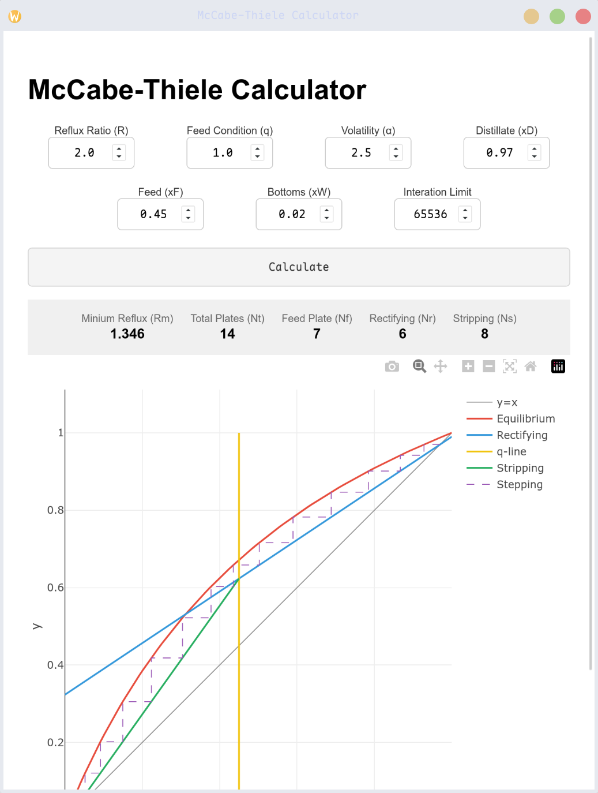

# Hylatum

A chemical engineering teaching and design aid for theoretical plate calculation, implemented in the way math describes it.

Applies and demonstrates the McCabe-Thiele method to calculate the number of theoretical plates, minimum reflux ratio, and optimal feed location for a distillation column given separation requirements, with a light-weight CLI program or a webview desktop application.

<video controls src="https://github.com/Hakeymeow/Pylatum/releases/download/v0.0.0/Draw.mp4" title="Title"></video>

## Features

- Minimum code - easy to read and reuse for humans and AI
- Simple core - no third-party dependencies in the core algorithm and CLI program
- Webview graphical interface - parameter input, results display, interactive diagram
- Demonstration - Manim animations to demonstrate McCabe-Thiele method

## Example

### CLI
Running the CLI with default parameters:

```bash
./hylatum-cli --R 2.0 --q 1.0 --alpha 2.5 --xD 0.97 --xF 0.45 --xW 0.02
```

```
================================================
Arguments
---
R=2.0            q=1.0            ɑ=2.5
xD=0.97          xF=0.45          xW=0.02
================================================
Results
---
Rm (Minimum Reflux Ration)     : 1.346127946128
Nt (Total Number)              : 14
Nf (Feed Location)             : 7
Nr (Rectifying)                : 6
Ns (Stripping and Reboiler)    : 8
================================================
```

### GUI
Running the GUI desktop application:

```bash
./hylatum-gui
```



## Quick Start

### From Binary

Download the pre-built executable for your platform from the
[latest release](https://github.com/Hakeymeow/Pylatum/releases/latest).

```bash
# CLI
./hylatum-cli --help

# GUI
./hylatum-gui
```

### From Source

**Prerequisites:** Python >= 3.14, [uv](https://docs.astral.sh/uv/)

```bash
# Install all dependencies (including dev tools)
uv sync --all-packages

# CLI calculator
uv run hy-cli

# GUI with interactive Plotly chart
uv run hy-gui

# Manim animation demonstrating the McCabe-Thiele method
uv run hy-render
```

## Project Structure

```
hylatum/
├── src/
│   ├── calc.py       # Core McCabe-Thiele algorithm (no dependencies)
│   ├── calc_gui.py   # pywebview GUI application
│   ├── index.html    # Frontend for the GUI (input form + Plotly chart)
│   ├── demo.py       # Manim animation for educational demonstration
│   ├── build.py      # Nuitka build script for standalone executables
│   └── plot.py       # Reflux ratio vs. plate count analysis (Matplotlib)
├── pyproject.toml    # Project metadata and dependencies
├── AGENTS.md         # Development reference for AI agents
└── README.md
```

## Principles

I learned two techniques for determining the number of theoretical plates, iterative calculation and graphical method. Although the program uses interative calculation, my introduction will focus on the graphical method, since they share the same basis and the graphical method is easier to illustrate.

### Assumptions

- **Theoretical plate**: the vapor and liquid leaving the same plate are in equilibrium.

- **Constant molar overflow**: molar flow rates of liquid and vapor are constant within rectifying section and stripping section respectively.

### McCabe-Thiele Method

The McCabe-Thiele method is a graphical technique for determining the number of theoretical plates by stepping off stages between equilibrium curve and operating lines. 

#### Vapor-Liquid Equilibrium (VLE)

According to the theoretical plate assumption, the vapor and liquid leaving the same plate are in equilibrium. The relationship between the vapor composition $y_i$ and the liquid composition $x_i$ at equilibrium in equilibrium is given by Raoult's law, expressed through relative volatility $\alpha$:
$$
    y_i = \frac{\alpha x_i}{1 + (\alpha-1)x_i}
$$
where $\alpha$ is the relative volatility of the light key component, $i$ is the index of the plate from which the vapor and liquid leave. An $\alpha\leq 1$ is invalid in the program, indicating that no separation can be achieved.

#### Operating Lines

The operating lines relate the composition of the vapor entering the plate, $y_{i+1}$, to the composition of the liquid leaving the same plate, $x_i$. Above the feed is the rectifying section, its operating line is
$$
    y_{i+1} = \frac{R}{R+1}x_{i} + \frac{1}{R+1}x_D
$$
where $R$ is the reflux ratio and $x_D$ is the composition of overhead product.

Below the feed is the stripping section. Its operating line is
$$
    y_{i+1} = \frac{L^{'}}{L^{'}-W}x_{i} - \frac{W}{L^{'}-W}x_W
$$
where $L^{'}$ is the liquid flow below the feed, $W$ is the bottoms flow, and $x_{W}$ is the composition of the bottom product.

#### q-Line

$q$ reflects the thermal state of the feed. Solving the operating line equations yields the q-line where they intersect:
$$
    y = \frac{q}{q-1}x-\frac{1}{q-1}x_F
$$
where $x_F$ is the composition of the feed.

With the q-line known, the stripping section operating line is usually obtained by connecting its two intersection points, one with the diagonal and the other with the q-line. The program follows this procedure.

| $q$ value | Feed condition | Temperature of the feed |
| --- | --- | -- |
| $q>1$ | subcooled liquid | below bubble point |
| $q=1$ | saturated liquid | equal to bubble point |
| $0<q<1$ | vapor-liquid mixture | between bubble point and dew point |
| $q=0$ | saturated vapor | equal to dew point |
| $q<0$ | superheated vapor | above dew point  |

#### Stage Construction

The assumption that the vapor leaving the first plate is fully condensed implies that $y_1 = x_D$. The McCabe-Thiele method starts with the condition $y_1 = x_D$ and ends when $x_m < x_W$ where $m$ is the determined number of theoretical plates. The graphical construction alternates between:

- Move horizontally to the equilibrium curve to get a new $x$ after equilibrium stage
- Move vertically to the operating line to get a new $y$ on the next plate

Each step corresponds to one theoretical plate. To minimize steps, the construction uses the rectifying operating line for $x>x_d$ and the stripping line for $x<x_d$, where $x_d$ is the feed intersection abscissa. This procedure implicitly embodies a greedy algorithm to maximize each step distance. The program implements it without formal proof.

### Mathematical and Programming Techniques

#### The Form of Line Equations

The denominator $q-1$ in the q-line will result in a ZeroDivisionError when $q=1$. To solve the problem elegantly, the program implements the q-line and operating lines in the form $ax+by+c=0$ which has no denominator.

#### The Minimum Reflux Ratio

If the intersection of the q-line and the operating lines falls above the equilibrium curve, the construction of stages cannot continue downward, causing infinite iterations. The critical reflux ratio that places the intersection on the equilibrium curve is known as the minimum reflux ratio, $R_m$.

The key to determine $R_m$ is to solve the q-line equation and equilibrium equation to find the intersection whose abscissa falls between 0 and 1. Substitutes the equilibrium equation to the q-line equation gives
$$
    \frac{\alpha x}{1 + (\alpha-1)x} - \frac{q}{q-1}x - \frac{1}{q-1}x_F = 0
$$

This is a quadratic equation when $q \ne 1$. Define 
$$
    f(x) = \frac{\alpha x}{1 + (\alpha-1)x} - \frac{q}{q-1}x - \frac{1}{q-1}x_F
$$
Since
$$
    f(0)\cdot f(1) = \frac{x_F}{q-1}\cdot\frac{x_F-1}{q-1} < 0
$$
by the intermediate value theorem, there exists a root between 0 and 1, making the discriminant unnecessary.

Converting the original equation to standard form yields 
$$
    q(\alpha-1)x^2 + [q-\alpha(q-1)-x_F(\alpha-1)]x - x_F = 0
$$
Define $a=q(\alpha-1)$, $b=q-\alpha(q-1)-x_F(\alpha-1)$, $c=-x_F$. It is conjectured that the root lying between 0 and 1 is given by
$$
    x = \frac{-b+\sqrt{b^2-4ac}}{2a}
$$
This conjecture, derived from graphical observation, remains unproven. The program implements it and performs well thus far.

$q=1$ should be an exception since it makes the original equation degenerate into a linear equation. But the equation in standard form doesn't degenerate with $q=1$ substituted into. With sympy I found
```python
>>> import sympy as sp
>>> x, y = sp.symbols('x y')
>>> alpha, xf = sp.symbols('alpha xf')
>>> q = 1
>>> a, b, c = q*(alpha-1), q-alpha*(q-1)-xf*(alpha-1), -xf
>>> sp.solve(sp.Eq(a*x*x+b*x+c, 0), x)
[xf, -1/(alpha - 1)]
```
where $x_F > 0 > -\frac{1}{\alpha-1}$. The conjecture is still valid when $q=1$.

## Record of Sessions
This program consists of artificial coding and vibe coding. Following are the vibe coding sessions.
<details>
    <summary>Sessions</summary>

- [**[/init-1]**](https://opncd.ai/share/MjX5DeGJ)
- [**[/init-2]**](https://opncd.ai/share/q2A70T6N)
- [**[/init-3]**](https://opncd.ai/share/vmATTxNu)

- [**[webview-qt]**](https://opncd.ai/share/BTdJ3FIB): I implemented the core McCabe-Thiele algorithm and decided to add a GUI with vibe coding. The agent added pywebview without [gtk] or [qt] extras to the dependencies, which may not work on Linux according to the official documentation, and manually added PyQt and other backend dependencies. The GUI took a long time to load — I thought (because the agent told me) it was due to the Qt backend's poor performance (but after the refactor I found the real culprit was waiting for the CDN).

- [**[webview-gtk]**](https://opncd.ai/share/AH5v4Pjk): There were other problems with the previous GUI. Its iteration visualization looked strange with two askew starting lines. The Qt backend dependencies were hard-coded in the source code, which prevented me from testing the GTK backend. It might be easier to build a new GUI, and I wanted a challenging task to see the advantage of the oh-my-openagent plugin.

- [**[pyinstaller]**](https://opncd.ai/share/lW3uFkxr): I tried building executables with PyInstaller at first but ran into a GTK issue. The Sisyphus agent tried its best and finally realized it is Sisyphus — and maybe realized it had become Sisyphus. The effort wasn't committed to the git repository, but the session is quite interesting.

- [**[nuitka]**](https://opncd.ai/share/wiQoPYCb): The Sisyphus agent recommended Nuitka before it gave up, so I switched. It did solve the GTK problem.

- [**[plot-R]**](https://opncd.ai/share/xwYH1QHK): I reviewed my tasks and found that I hadn't analyzed the correlation between $R$ and the plate number. I told the agent to do it, both to fill the gap and to add more vibe coding content to my report.

- [**[plotly]**](https://opncd.ai/share/yZcapNtP): `index.html` must contain `plotly.min.js` to render the plot correctly. It was originally imported via CDN, but I wanted the program to work offline. I noticed the agent had fetched a static `plotly.min.js` from the virtual environment, so I asked whether the program could do that on its own.

- [**[nuitka-venv]**](https://opncd.ai/share/zGEp5R2l): It struck me that I hadn't included plotly in `build.py`, yet the GUI program worked — so I assumed Nuitka was packaging the entire virtual environment. I removed manim and matplotlib and rebuilt the program. It still worked fine and the size did decrease. I then asked the agent to verify this and figure out what was going on.

- [**[ModuleError]**](https://opncd.ai/share/HEZb6N4Q): The hylatum-gui binary could not found module named 'hylatum'. 

</details>

## License
[MIT](../LICENSE)
